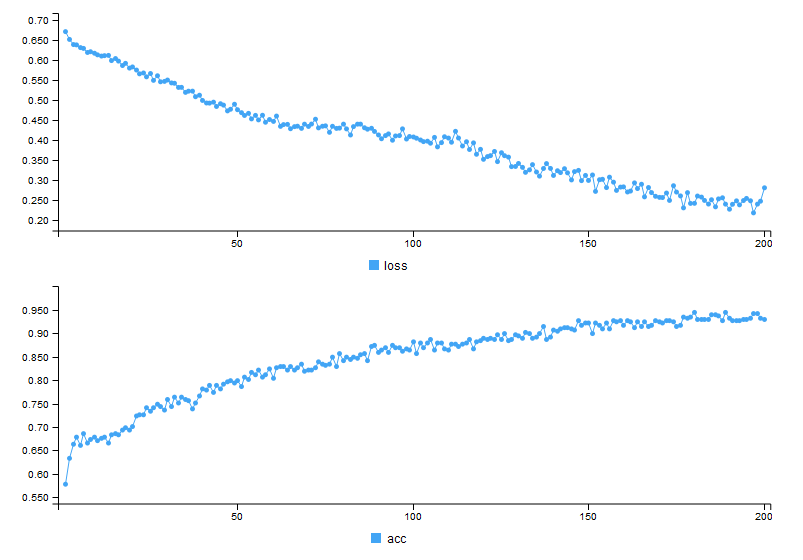

## Dataset description

```
- The dataset is compiled by the University of Wisconsin in 1992.
- Each row of data contains a summary of the cells in a sample. 
- The summary metrics are: 
   - mean
   - standard deviation
   - worst (or largest)
- Ten real-valued features are computed for each cell nucleus based on the three summary metrics (except diagnosis - the target variable):
  - radius (mean of distances from center to points on the perimeter) 
  - texture (standard deviation of gray-scale values) 
  - perimeter 
  - area 
  - smoothness (local variation in radius lengths) 
  - compactness (perimeter^2 / area - 1.0) 
  - concavity (severity of concave portions of the contour) 
  - concave points (number of concave portions of the contour) 
  - symmetry 
  - fractal dimension ("coastline approximation" - 1)
- In all, we have 569 instances with 32 attributes per instance.
```
```{r}
knitr::opts_chunk$set(echo = TRUE)
library(tensorflow)
library(tfestimators)
library(shiny)
library(shinythemes)
library(readr)
library(plotly)
library(mice)
library(keras)
library(kerasR)
library(caTools)
library(corrplot)
library(corrr)
library(caret)
library(gridExtra)
library(pROC)
library(matrixStats)
library(NeuralNetTools)
library(neuralnet)
library(keras)
library(magrittr)
dataset <- read.csv("data.csv", na.strings = '?', stringsAsFactors = F)
dataset <- dataset[, 1:32]
```

## Structure and Summary

```{r}
str(dataset)
summary(dataset)
```

## Correlation Analysis

```
- Summary tells us that the data is imbalanced and there is a lot of correlation between the attributes.
- Considering only the features for the mean values (10 features), leaving out the standard deviation and worst features. 
- This will reduce our feature space substantially, making our model more generalizable. 
- The correlation plot uses clustering to make it easy to see which variables are closely correlated with each other. 
- The closer each variable is to each other the higher the relationship while the opposite is true for widely spaced variables. 
- The color of the line represents the direction of the correlation while the line shade and thickness represent the strength of the relationship.
```
```{r}
corr_mat <- cor(dataset[,3:ncol(dataset)])
network_plot(correlate(corr_mat))
```

## One Hot Encoding
```
We will use the format of binary classificaiton for our target variable.
```
```{r}
prop.table(table(dataset$diagnosis))
dataset$diagnosis[dataset$diagnosis=='M'] <-1
dataset$diagnosis[dataset$diagnosis=='B'] <-0
head(dataset$diagnosis, 20)
```

## Train and Test Splitting
```
The dataset is split into two sets with a split ratio of 0.70.
```
```{r}
library(caTools)
X <- data.matrix(dataset[3:32])
y <- dataset$diagnosis
set.seed(1000)
split = sample.split(dataset$diagnosis, SplitRatio = 0.70)
X_train = subset(X, split==TRUE)
X_test = subset(X, split==FALSE)
split = sample.split(dataset$diagnosis, SplitRatio = 0.70)
y_train = subset(y, split==TRUE)
y_test = subset(y, split==FALSE)
head(X_train,5)
head(y_train,20)
head(X_test,5)
head(y_test,20)
```

## Normalize features (zero mean, unit variance)
```
We are going to normalize X_train and X_test.
```
```{r}
X_train = scale(X_train)
X_test = scale(X_test)
head(X_train,3)
head(X_test,3)
```

## Neural Network Visualization
```
- Hidden Layer 1: 16 nodes
- Hidden Layer 2: 8 nodes
- Hidden Layer 3: 6 nodes
- Output Layer: 2 nodes
```
```{r}
B <- c(rep(0, 397),1)
M <- c(0, rep(1, 397))
set.seed(2)
NN = neuralnet(B+M ~ radius_mean+texture_mean+perimeter_mean+area_mean+smoothness_mean+compactness_mean+concavity_mean+concave.points_mean+symmetry_mean+fractal_dimension_mean+radius_se+texture_se+perimeter_se+area_se+smoothness_se+compactness_se+concavity_se+concave.points_se+symmetry_se+fractal_dimension_se+radius_worst+texture_worst+perimeter_worst+area_worst+smoothness_worst+compactness_worst+concavity_worst+concave.points_worst+symmetry_worst+fractal_dimension_worst, X_train, hidden = c(16,8,6,4) , linear.output = TRUE )
plotnet(NN)
```

## Adding the hidden layers & hyperparameters
```
- We will use Keras, a package based of R Tensorflow core API.
- Now we will include all the hidden layers by adding specific weights and biases to each layer.
- We will use a sequential model with hidden layers having RELU function while the output is sigmoid.
- For compiling the model:
 - Optimizer used is RMSPROP.
 - The loss is done by binary crossentropy method whose formula given two distributions over discrete variable x, where q(x) is the estimate for true distribution p(x).
 - The metric used is accuracy.
```
```{r}

model <- keras_model_sequential() %>% 
  layer_dense(units = 16, activation = "relu", input_shape = c(30)) %>% 
  layer_dense(units = 8,  activation = "relu") %>% 
  layer_dense(units = 6,  activation = "relu") %>%
  layer_dense(units = 1,  activation = "sigmoid")
model %>% compile(
  optimizer = optimizer_rmsprop(lr=0.001),
  loss = "binary_crossentropy",
  metrics = c("accuracy")
)
```

## Compiling and plotting the model (Feed Forward)
```
- We will use forward propogation as the basis of the algorithm
- Training:
  - At each step of gradient descent, we do forward propagation with the current model parameters to get an output.
  - At each layer of the network, we compute a matrix multiplication of the output from the previous layer and the weights connecting the previous layer to the current layer.
  - We will add the bias to the current layer.
  - An activation funciton like Sigmoid is applied, which converts the weighted result into a value between 0 and 1, indicating the classification at that layer.
  - We will then use backpropogation to adjust our parameters to minimize loss from that output.
- Classification:
  - We will thus be able to classify based on the input the network receives.
- Hyperparamters:
 - Learning Rate : We will use the default from Keras.
 - Epochs: 200
 - Batch size: 1
- Using Keras gave me a loss of 0.3556 and an accuracy 0.9070.
```
```{r}
breast_model <- model %>% fit(
  X_train,
  y_train,
  epochs = 200,
  batch_size = 1)
results <- model %>% evaluate(X_test, y_test)
```

##  Loss and Accuracy
```
We can thus see from the evaluation test above that we got a nice accuracy of 92.96% and a loss of 0.28%
```

